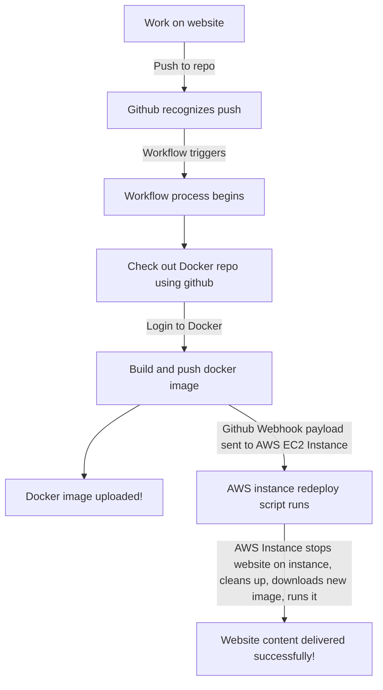

## The general idea of this project is to learn about continuous deployment using docker, dockerhub, github, github actions, webhooks, and more.

### Process Steps:
#### Milestone 1
- Install Docker Desktop and sudo git install docker on WSL2
- Build a container using a dockerfile and command
  - dockerfile is in repository for example
  - command syntax: `docker build -t <imagename>:<version>`
- Run container using command `docker run -p <open port>:80 <imagename>
  - `-p` binds port, left port is an open port ON YOUR DESKTOP COMPUTER/TERMINAL, right port is 80, required for HTTP connections
- View project locally by visiting the website http://localhost:<port used>

#### Milestone 2
- Create a DockerHub repo by visiting https://hub.docker.com/, logging in, and choosing "create repository"
  - Set options that are self-explanatory
- Authenticate with DockerHub by creating an authentication token in DockerHub settings and using `docker login -u <username>` and inputting the token in the prompt
- Go to Github repo to configure secrets
  - Settings --> Secrets --> Actions
  - Create two new repository secrets, DOCKER_USERNAME and DOCKER_PASSWORD
    - Input username as normal, use auth token as DOCKER_PASSWORD
- Go to repo Actions to create a workflow, create a new one, likely starting from a provided template
  - Workflow provided is in repo
  - On a push to master branch
    - Runs on ubuntu-latest
      - Set env variable DOCKER_REPO to the name of the repo
      - Check out the docker repo using actions/checkout@v3
      - Log in to dockerhub with login-action@1 using secrets.DOCKER_USERNAME and secrets.DOCKER_PASSWORD
      - Build and push a docker image using docker/build-push-action@v2.10.0, tag with secrets.DOCKER_USERNAME / env.DOCKER_REPO : latest
  
#### Milestone 3
- Container restart script included below and in repository
```
#!/bin/bash

# Stop the old project from running
docker stop project5
# Clean up old projects for cleanliness's sake
docker system prune -f -a
# Pull the new image that was just pushed
docker pull ejkwsu/cs3120project5:latest
# Run the image that was just pushed
docker run -d --name project5 -p 80:80 ejkwsu/cs3120project5:latest
```

- Webhook redeploy script included in repository
  - Uses .json because .yaml parser is broken
  - Set id to what you want
  - Triggers on matching a secret set us payload-hash-sha1
  - The secret is COMPLETELY UNGUESSABLE FOR SECURITY REASONS
    - This is defeated by including the script in the repository
      - Look it's the password my friends use for Elden Ring
- Webhook settings in repo Settings --> Webhooks --> Add webhook
  - Set it as json
  - Set the secret to what you used above
  - The Payload URL is your URL/IP on port 9000 by default, /hooks/<id> where <id> is what you put in the script
- Can set up notifications on push events in repo settings --> Email notifications
   - Not actually sure what is wanted here because I don't remember this being covered in class
  
#### Diagram

